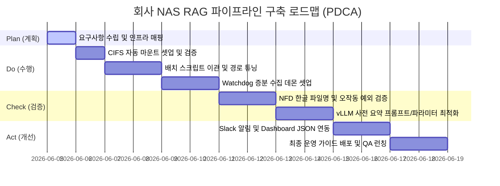

# 📋 회사 NAS 데이터 분석 및 지식 RAG 파이프라인 구축 계획서 (Plan)

이 계획서는 **PDCA (Plan-Do-Check-Act) 사이클**의 **Plan(계획)** 단계 문서입니다. 아우룸생태연구소의 사내 고성능 AI 서버(아톰)와 회사 NAS(`//192.168.0.97/dgxbackup`)를 연동하여 보안성을 유지하며 초고속 지식 검색(RAG)을 서빙하는 파이프라인을 철저히 계획하고 단계별 실행 로드맵을 정의합니다.

---

## 🎯 1. 프로젝트 목적 및 목표

### A. 배경 및 문제 의식
- 회사 NAS 내부에 축적된 다량의 문서(제안서, 보고서, 장비 정보 등)가 구조화되지 않은 채 방치되어 있으며, 필요한 정보를 검색하여 찾는 데 수십 분 이상의 시간이 소요됨.
- 외부 클라우드 LLM(ChatGPT, Claude 등)을 사용할 경우 **사내 기밀 데이터가 외부망으로 유출되는 심각한 보안 리스크**가 상존함.

### B. 최종 목표
1. **회사 NAS 완전 자동 인덱싱**: NAS 업로드 감시 및 실시간 일괄 파싱 구축.
2. **보안 지식 검색(RAG) 구현**: 아톰 서버 내부(Local) 네트워크망에서만 동작하는 초고속 RAG 구현.
3. **의미적 문서 탐색 능력 확보**: 72B 대용량 모델(vLLM)을 이용해 미리 문서 요약본과 태그를 사전에 생성·임베딩하여 검색 정밀도 극대화.

---

## 🏗️ 2. 시스템 아키텍처 및 하드웨어 구성

### A. 인프라 매핑 상태
- **회사 NAS**: `//192.168.0.97/dgxbackup` (CIFS Samba 공유 대역)
- **AI 추론 및 가공 서버 (아톰)**: `100.98.149.127` (NVIDIA Blackwell GB10 / 128GB RAM)
- **로컬 맥 마운트 위치**: `/Volumes/caiser77/dgx_workspace`
- **프로젝트 루트 폴더**: `/Volumes/caiser77/dgx_workspace/002. 회사 NAS 분석`

### B. 소프트웨어 스택
- **텍스트 가공 엔진**: `extract_data.py` (pymupdf, openpyxl, pillow)
- **정밀 OCR 엔진**: `fitz` 기반 아톰 OCR 컨테이너 (Port `7870`)
- **임베딩 모델**: `sentence-transformers/all-MiniLM-L6-v2` (Local)
- **로컬 벡터 스토어**: `FAISS-CPU` (inner_product metric)
- **대형 추론 서버 (vLLM)**: `Qwen/Qwen2.5-72B-Instruct-AWQ` (Port `8088`, Marlin 가속)

---

## 📅 3. PDCA 마일스톤 및 상세 실행 일정

### 1단계: P (Plan) - 현재 단계
- 사내 NAS 연동 범위 설정, 폴더 구조 기획, 자원 및 제약 사항 분석.

### 2단계: D (Do) - 구현 및 셋업
- **NAS 상시 마운트 연동**: 아톰 서버 시작 시 `/etc/fstab` 또는 `systemd` 마운트 유닛을 통해 `//192.168.0.97/dgxbackup`이 자동으로 `/mnt/dgxbackup`에 마운트되도록 구성.
- **배치/실시간 감시 자동화**: `watchdog_pipeline.py`를 확장하여 `/mnt/dgxbackup/uploads` 경로의 신규 파일 유입 감지 시 `batch_process.py`를 자동 트리거하도록 서비스화.

### 3단계: C (Check) - 테스트 및 튜닝
- **한글 자소분리(NFC/NFD) 검증**: macOS에서 SMB 업로드 시 한글 자모가 분리되어 경로를 읽지 못하는 예외가 없는지 리눅스 파일시스템 단에서 자동 NFD normalization 처리.
- **RAG QA 품질 튜닝**: `max_tokens` 및 `top-k` 임계치 튜닝을 통해 답변 잘림 및 할루시네이션(환각) 예방 검증.

### 4단계: A (Act) - 보완 및 배포
- **장애 모니터링**: NAS 마운트가 해제되거나 네트워크 통신 지연 시 Slack 자동 Webhook 경고 송출 및 자동 마운트 재시도(`reconnect`) 적용.
- **인프라 갱신**: 최종 완료 상태를 `.pdca-status.json`에 아카이빙하고 현업 AI 대화 쉘 서비스(Hermes) 및 대시보드와 통합.

---

## ⚠️ 4. 예상되는 위험 요소 및 대책 (Risk Management)

| 위험 요소 (Risk) | 예상 원인 | 완화 대책 (Mitigation) |
| :--- | :--- | :--- |
| **NAS 마운트 해제 현황** | 불안정한 네트워크 대역폭 혹은 NAS 리부팅 | `mount` 상태를 주기적으로 체크하는 크론탭 헬스체커 스크립트를 작성하여 자동 `mount -a` 시도 |
| **OCR 서버 500 에러** | fitz 패키지 또는 PyMuPDF 라이브러리 간섭 | OCR 컨테이너 백엔드 파이썬 예외 처리를 디버깅하고 필요시 예외 발생 시 순수 OCR fallback 바이패스 로직 적용 |
| **vLLM API 타임아웃** | 72B 대형 연산으로 인한 디코딩 병목 | Marlin 가속 커널(`awq_marlin`) 및 `--enforce-eager` 모드 유지 보장 및 타임아웃 파라미터를 최소 300초로 상향 유지 |
| **한글 파일명 파싱 실패** | macOS-Linux 간 유니코드 규격 차이 | 스크립트 내부에서 `unicodedata.normalize('NFC', path)`를 강제 변환하여 경로 접근 무결성 보장 |

---

## 📝 5. 다음 행동 절차 (Next Action Items)
1. 본 계획서에 대한 사용자 검토 및 최종 승인.
2. 아톰 서버 상에서 `192.168.0.97` 회사 NAS 경로의 ping 및 수동 CIFS 마운트 커넥션 상태 확인.
3. `002. 회사 NAS 분석` 디렉터리 내에 `scripts/`, `configs/`, `data/` 등의 뼈대 디렉터리 개설.
