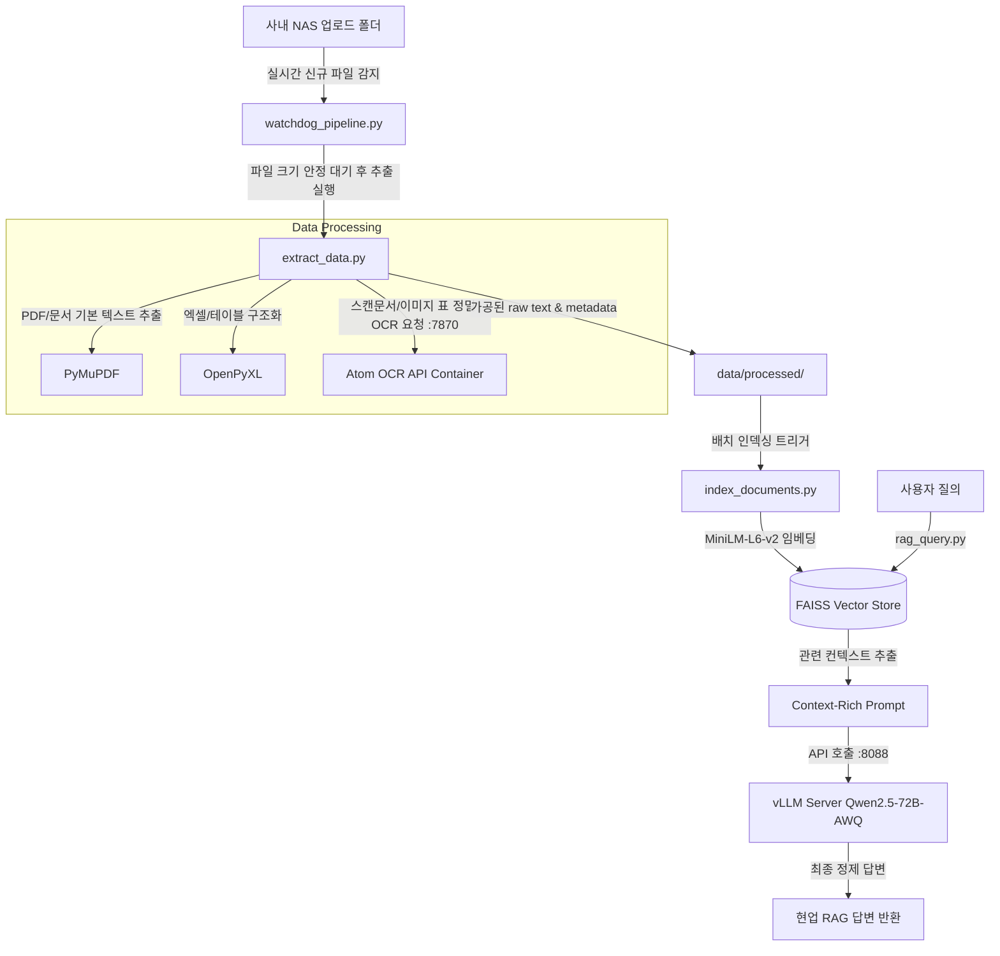

# 🏗️ 회사 NAS 데이터 분석 및 지식 RAG 파이프라인 설계서 (Design)

이 문서는 **PDCA (Plan-Do-Check-Act) 사이클**의 **Design(설계)** 단계 문서입니다. 아우룸생태연구소의 사내 고성능 AI 서버(아톰)와 회사 NAS(`100.94.64.83`, 구 `192.168.0.97`)를 연동하고, 실시간 실무 지식 RAG 서비스를 서빙하기 위한 파이프라인의 설계 명세를 정의합니다.

---

## 1. 데이터 흐름 및 프로세스 인터페이스 (Data Flow)

사내 NAS에 업로드되는 제안서, 보고서, 현장 이미지 등은 아래의 파이프라인 단계를 거쳐 로컬 RAG 서비스용 벡터 데이터로 가공됩니다.



### A. Watchdog 감지 데몬 (`watchdog_pipeline.py`)
- **역할**: 마운트된 NAS 폴더(예: `/mnt/dgxbackup/uploads`)를 1초 주기로 실시간 감시합니다.
- **안정화 필터**: 파일 복사 중 발생할 수 있는 데이터 손상을 막기 위해 파일 크기가 3초 동안 변화가 없을 때 가공 단계(`extract_data.py`)를 기동합니다.

### B. 파서 및 OCR 엔진 (`extract_data.py`)
- **텍스트 가공**: 텍스트 데이터의 원본 무결성을 유지하며, 파일 형식별 파서를 통해 텍스트와 이미지 메타데이터를 분리하여 JSON으로 구조화합니다.
- **OCR 폴백(Fallback)**: 가공 필터 중 텍스트가 추출되지 않는 이미지 PDF나 현장 조사 사진은 아톰 서버 내부의 `7870` 포트 OCR API 서비스에 전송하여 정밀 문자 및 표(Table) 데이터를 축적합니다.

### C. FAISS 인덱싱 엔진 (`index_documents.py`)
- **임베딩 파라미터**: `sentence-transformers/all-MiniLM-L6-v2` 모델을 로컬에서 구동하여 512자 단위(오버랩 10%)로 청킹된 문서 조각들을 384차원 벡터로 인덱싱합니다.
- **인덱스 저장소**: `data/indexes/faiss/` 경로에 가볍고 로컬 탐색 속도가 우수한 FAISS 인덱스 이진 파일로 저장합니다.

---

## 2. 인프라 설계 및 마운트 방안 (Infrastructure Setup)

### A. Tailscale 네트워크 대역
* **아톰 서버**: `100.98.149.127`
* **회사 NAS**: `100.94.64.83` (Samba 서비스 제공)

### B. NAS 마운트 설계 (CIFS)
아톰 서버 내부에서 NAS 공유 자원(`//100.94.64.83/dgxbackup`)을 `/mnt/dgxbackup` 디렉토리에 마운트하여 파이프라인의 입출력 저장소로 삼습니다.

1. **보안 연동 크레덴셜 구성 (`/home/caiser77/.smbcredentials_nas`)**
   보안 유출을 방지하기 위해 마운트 구문에 패스워드를 노출하지 않고, 크레덴셜 파일을 생성하여 참조합니다.
   ```text
   username=kwon-incheon01
   password=aurum2026!
   domain=WORKGROUP
   ```
2. **마운트 유닛 / fstab 영구 마운트 설정**
   네트워크 지연이나 기기 재부팅에 대비하여 아래의 마운트 옵션을 필수 구성합니다.
   ```text
   # /etc/fstab 등록 예시
   //100.94.64.83/dgxbackup /mnt/dgxbackup cifs credentials=/home/caiser77/.smbcredentials_nas,iocharset=utf8,vers=3.0,nofail,x-systemd.automount 0 0
   ```
   - `nofail`: NAS 부팅 지연 시 시스템 부팅 락 방지.
   - `x-systemd.automount`: 마운트 포인트 접근 시 자동 온디맨드 커넥션 수립.

---

## 3. 예외 및 오류 제어 (Error Management)

### A. 한글 자모분리 (NFC/NFD) 정규화
- **이슈**: macOS에서 파일 업로드 시 자모가 분리(예: `ㅎ-ㅝ-ㄴ-ㄱ-ㅡ-ㄹ`)되어 저장되어 Linux 파일시스템 내 경로 인식이 실패하는 문제가 발생합니다.
- **대책**: 모든 가공 스크립트의 파일 로딩 함수 진입부에서 `unicodedata.normalize('NFC', file_path)` 처리를 강제하여 접근 무결성을 100% 확보합니다.

### B. OCR API 연결 불안정 폴백
- `7870` 포트의 OCR 컨테이너 통신이 일시적인 네트워크 지연으로 실패할 경우, 가공 프로세스를 즉시 종료하지 않고 내부 EasyOCR 및 Tesseract를 로컬 CPU 백그라운드 모드로 순차 구동하여 데이터 누수를 차단합니다.

---

## 4. 구현 및 검증 상세 단계 (Milestone Do & Check Plan)

1. **[Do]** 아톰 서버 내부의 마운트 인증 크레덴셜 구성 및 수동 커넥션 상태 최종 수립.
2. **[Do]** `002. 회사 NAS 분석/scripts` 하위에 `watchdog_pipeline.py`, `extract_data.py`, `index_documents.py`, `rag_query.py` 코드 이관 및 경로 튜닝.
3. **[Check]** NAS 마운트 디렉토리 감시 작동 상태 점검 및 PDF/이미지 파싱 데이터 구조 검증.
4. **[Check]** 72B 대형 추론 모델 연동 헬스체크 및 RAG QA 결과 일치성 보완.
5. **[Act]** 최종 실행 데몬 등록 및 대시보드 API 상태 JSON 연동 배포.
