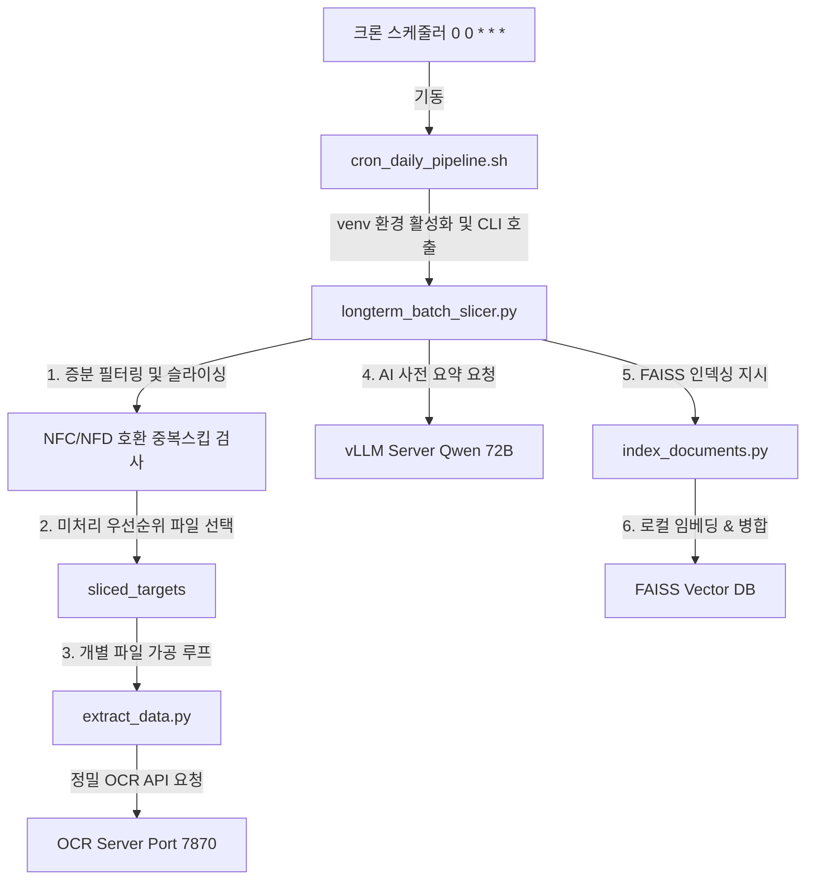

# 📐 [003. NAS 장기 배치 파이프라인] 시스템 설계서 (Design)

본 설계서는 10개년 비정형 NAS 데이터를 매일 점진적으로 일괄 가공하고 FAISS 인덱스에 병합하기 위한 시스템 설계 사양을 정의합니다.

---

## ⚙️ 1. 시스템 모듈 구성
본 배치 시스템은 크게 두 가지 실행 단위와 기존 모듈의 연동으로 구성됩니다.

---

## 🛠️ 2. 상세 컴포넌트 설계

### A. 슬라이싱 및 필터링 엔진 (`longterm_batch_slicer.py`)
* **동작 흐름**:
  1. **디렉토리 재귀 스캔**: 지정된 원본 경로(`--input-dir`)를 순회하여 지원하는 확장자 문서군을 모두 리스트업합니다.
  2. **SHA1 고유 파일 해시 계산**: 각 파일에 대해 고유 해시 기반 `safe_stem`을 계산하여, 기처리된 결과물 파일명(`metadata/{stem}.metadata.json`)의 유무 및 성공(`status == "success"`) 정보를 확인합니다.
  3. **시간순 정렬 및 슬라이싱**: 가공되지 않은 미처리 대상들에 대해 수정 시간(`mtime`) 기준으로 정렬하고, 하루 한도(`--limit`)만큼 잘라내어 큐에 넣습니다.
  4. **순차 가공 및 빌드**: 개별 가공 성공 시, 텍스트 상단에 `[AI 기반 사전 요약 및 메타데이터]` 헤더를 삽입한 뒤, 마지막에 `index_documents.py`를 호출하여 전체 인덱스를 갱신 빌드합니다.

* **핵심 CLI 인수 명세**:
  * `--input-dir`: 원본 NAS 마운트 지점.
  * `--processed-dir`: 추출 텍스트 및 메타데이터 저장 디렉토리.
  * `--index-dir`: 최종 FAISS 백터 색인 저장 디렉토리.
  * `--limit`: 1회 구동 당 최대 처리 개수 (기본값: 300).
  * `--ocr-endpoint` / `--vllm-endpoint`: 각각 로컬 OCR API 및 Qwen 72B 모델 서빙 API 엔드포인트 주소.

### B. 자동 실행 쉘 스크립트 (`cron_daily_pipeline.sh`)
* **동작 흐름**:
  1. UTF-8 로케일 환경 변수 설정 (`ko_KR.UTF-8`).
  2. 원격 서버 내 파이썬 가상환경(`venv/bin/activate`) 소스 로드 및 활성화.
  3. `longterm_batch_slicer.py` 명령어를 적절한 타겟 디렉토리 파라미터와 함께 백그라운드가 아닌 동기식으로 기동.
  4. 쉘 실행 로그 및 콘솔 표준 출력을 `logs/cron_run.log`에 누적 기입하고, 일자별 성공 요약을 `logs/daily_report.log`에 저장.

---

## 🚨 3. 예외 및 실패 대응 설계 (Fail-safe)
* **네트워크/API 일시적 끊김**: OCR 또는 vLLM 호출 중 타임아웃 발생 시, 스크립트는 해당 파일만 실패(`failed_count += 1`)로 마킹하고 전체 프로세스가 멈추지 않도록 다음 파일로 루프를 이어 나갑니다.
* **증분 가공 자동 복구**: 실패한 파일은 메타데이터가 생성되지 않거나 `status != "success"`로 기입되므로, 다음 날 자정 배치 기동 시 자동으로 미처리 대상 큐에 포함되어 재수집(Retry)됩니다.
