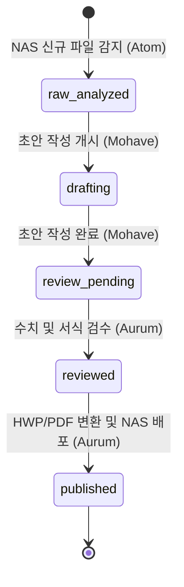

# 📐 아톰-모하비-아우룸 3단 협업 파이프라인 상세 설계서 (Design)

본 설계서는 Linux 아톰 서버, macOS 모하비 맥북, 그리고 최종 배포를 담당하는 아우룸 간의 지능형 문서 협업 파이프라인의 **데이터 사양, 상태 기계(State Machine), 동기화 아키텍처 및 세부 설계 사항**을 정의합니다.

---

## 1. 데이터 사양 (Data Specification)

협업 시 문서의 상태를 추적하고 에이전트 간 업무를 인계하기 위해, 모든 중간 가공 문서(`*.md`) 상단에 아래의 **Frontmatter 규격**을 강제 준수합니다.

```markdown
---
status: raw_analyzed            # raw_analyzed -> drafting -> review_pending -> reviewed -> published
source_file: "field_report_2026.xlsx"
original_nas_path: "/mnt/nas2026/경인사업/양서파충류/field_report_2026.xlsx"
year_vendor: "2026 LH"
project_name: "경인사업"
class_name: "양서파충류"
tags: ["#2026LH", "#경인사업", "#양서파충류"]
assigned_agent: "Mohave"       # 현재 문서를 처리해야 할 대상 에이전트 (Atom, Mohave, Aurum)
last_updated: "2026-06-20T18:57:00+09:00"
---
```

### 🏷️ 상태 설명 (Status Transition)
1. **`raw_analyzed`:** 아톰 서버가 파일 유입을 감지하여 텍스트를 추출하고 Qwen 72B를 통해 1차 요약을 완성한 상태. (`assigned_agent: Mohave`)
2. **`drafting`:** 모하비 에이전트가 요약 노트를 감지하여 옵시디언 RAG 정보를 결합하여 정식 보고서 초안 작성을 시작한 상태. (`assigned_agent: Mohave`)
3. **`review_pending`:** 모하비가 초안 작성을 완료하고 아우룸 에이전트에게 보고서 양식 및 데이터 수치 무결성 검수를 요청한 상태. (`assigned_agent: Aurum`)
4. **`reviewed`:** 아우룸이 최종 서식 검증 및 검수를 완료하고 배포 대기 상태로 만든 것. (`assigned_agent: Aurum`)
5. **`published`:** 최종 보고서가 정식 파일(HWP/PDF)로 변환되어 NAS 배포 경로에 복사되고 텔레그램 배포 알림이 완료된 최종 상태. (`assigned_agent: none`)

---

## 2. 상태 기계 다이어그램 (State Machine)



---

## 3. 동기화 및 전송 아키텍처 (Sync & Transport)

아톰(Linux)과 모하비(macOS 맥북) 간의 파일 교환은 아톰 서버 내부의 `dgx_workspace/data/processed/obsidian_notes` 영역과 맥북 로컬 옵시디언 볼트 폴더 간에 **보안 Rsync 터널**을 통해 실시간/주기적 동기화됩니다.

* **동기화 유틸리티:** `scripts/sync_obsidian_notes.sh`
* **동기화 방향:** 양방향 동기화(rsync update-only) 혹은 아톰이 생성한 `*.summary.md`를 단방향 전송 후, 모하비가 작성한 `*.draft.md`를 수집하는 분할 전송 방식 적용.
* **한글 인코딩 변환:** 동기화 단계 초입에서 리눅스/맥간 유니코드 자모분리 문제를 방지하기 위해 파일 경로 및 파일명에 대해 NFC 정규화 코드를 강제 수행합니다.

---

## 4. 사용자 피드백 통합 처리 (Feedback Integration)

1. 아톰 서버가 요약/분류를 수행할 때 `aurum_nas_rules.db`를 조회하여 교정 규칙이 매칭되는지 체크합니다.
2. 만약 매칭될 경우, 에르메스 프롬프트 입력 파라미터 단에 `[과거 사용자 교정 피드백 / 학습 규칙]` 태그로 교정 지시 사항을 바인딩하여 LLM 추론에 직접 입력시킵니다.
3. 이를 통해 AI 에이전트가 겪는 도메인 특화 용어의 잘못된 분류 실수를 영구적으로 극복합니다.
