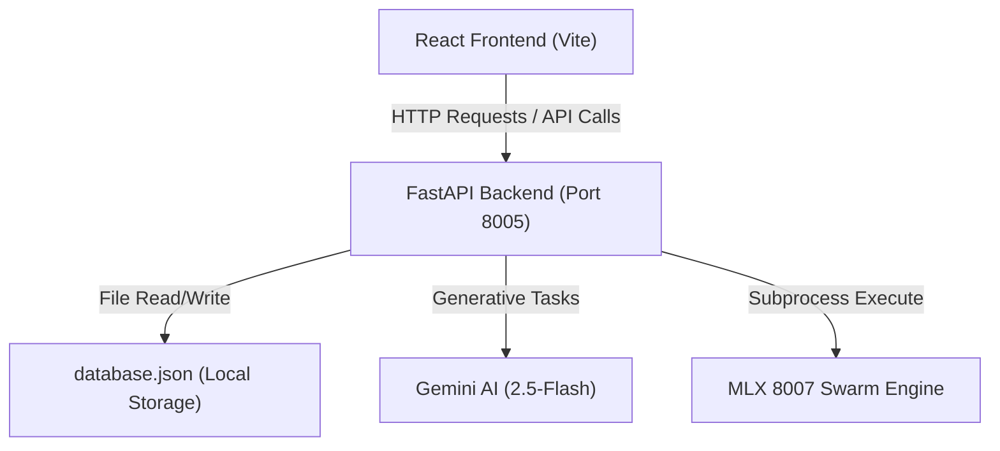
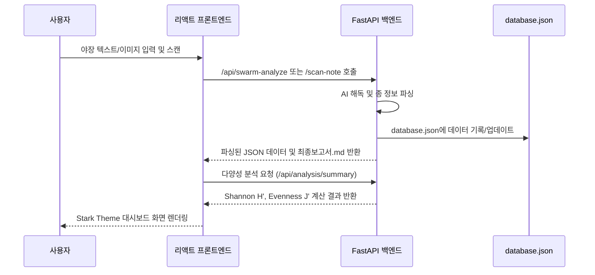

# fauna-dashboard-core 기술 설계서 (Design Document)

> **요약**: Stark Dark Monospace 테마 기반의 프론트엔드 UI와 FastAPI 백엔드, AI 스캔, GIS 정밀 도면 중첩 및 HWPX 보고서 출력을 결합한 통합 생태 대시보드 시스템 상세 설계.
>
> **프로젝트**: Fauna_Dashboard
> **버전**: 1.0
> **작성자**: Antigravity AI
> **날짜**: 2026-05-31
> **상태**: Approved
> **기획서**: [fauna-dashboard-core.plan.md](../../01-plan/features/fauna-dashboard-core.plan.md)

---

## 1. 개요 (Overview)

### 1.1 기술 설계 목표
- **Stark Dark Monospace 테마 구현**: Berkeley Mono 폰트와 `#201d1d` / `#fdfcfc` 단일 톤을 활용하여 모노스페이스 터미널 스타일의 프리미엄 UI 제공.
- **다분류군 생태 지수 분석 자동화**: 종 다양성 지수(Shannon H', Evenness J')의 실시간 및 누적 자동 산출.
- **스마트 공간 좌표 정제**: CAD, SHP, KML 파일 업로드 시 5186/5179/5181/3857 투영좌표계를 실시간 감지하여 WGS84 위경도 좌표로 백엔드에서 정밀 보정하고, 생태 조사 좌표와 실시간 융합 시각화.
- **호환성 높은 보고서 출력**: UTF-8-BOM 한글 안깨짐 CSV 및 XML 기반의 무결한 국가 표준 HWPX 한글 보고서 패키지 생성.

### 1.2 설계 원칙
- **Single Source of Truth**: 모든 생태 원시 데이터는 `database.json` 파일에 저장되며 백엔드를 통해 실시간 로드 및 동기화됨.
- **Minimalistic Utility Styling**: ad-hoc 스타일 사용을 배제하고, DESIGN.md에 정의된 Stark Theme의 CSS 변수 토큰 및 4px 보더 반경 규칙을 엄격하게 고수함.

---

## 2. 아키텍처 (Architecture)

### 2.1 구성 다이어그램 (Component Diagram)


### 2.2 데이터 흐름 (Data Flow)


### 2.3 의존성 (Dependencies)

| 컴포넌트 | 의존성 패키지/환경 | 용도 |
|-----------|-----------|---------|
| **백엔드 (Python)** | `fastapi`, `uvicorn`, `pyproj`, `ezdxf`, `pyshp`, `lxml`, `google-generativeai` | API 서버 구동, 좌표 변환, CAD/SHP/KML 파싱, Gemini AI 연동 |
| **프론트엔드 (React)** | `react`, `leaflet`, `react-leaflet`, `lucide-react` | 대화형 대시보드 UI, 생태 지도 렌더링, 아이콘 리소스 |

---

## 3. 데이터 모델 (Data Model)

### 3.1 엔티티 정의 (Entity Definition)
생태 데이터베이스(`database.json`)에 저장되는 핵심 생물종 레코드 규격입니다:

```typescript
interface FaunaRecord {
  surveyId: number;         // 조사 차수 (1, 2, 3...)
  class: string;            // 분류군 (포유류, 조류, 어류, 양서파충류, 저서무척추)
  family: string;           // 과 (Family)
  species: string;          // 종명 (Common Name)
  scientificName: string;   // 학명 (Scientific Name)
  count: number;            // 발견 개체수 (단순 숫자)
  traces: string;           // 흔적 유형 (V: 관찰, D: 사체, F: 배설물, S: 소리 등)
  protected: string | boolean; // 법적보호종 여부 (등급 표기 또는 false/일반종)
}
```

### 3.2 공간 피처 구조 (GIS Feature Collection)
도면 중첩 및 공간 병합에 사용되는 GeoJSON 표준 구조입니다:

```json
{
  "type": "FeatureCollection",
  "features": [
    {
      "type": "Feature",
      "properties": {
        "name": "수달 발견 지점",
        "species": "수달",
        "layer_type": "Range"
      },
      "geometry": {
        "type": "Point",
        "coordinates": [126.884, 37.452]
      }
    }
  ]
}
```

---

## 4. API 명세 (API Specification)

### 4.1 엔드포인트 목록

| HTTP 메서드 | 경로 | 설명 | 권한 |
|--------|------|-------------|------|
| **GET** | `/load-data` | `database.json` 동기화 및 전체 생태 리스트 반환 | Public |
| **POST** | `/save-data` | 대시보드에서 수정한 그리드 데이터 영구 저장 | Public |
| **GET** | `/api/get-survey-text` | 야장 원본 텍스트 기록 조회 | Public |
| **GET** | `/api/get-report` | 빌드된 최종 보고서 마크다운 조회 | Public |
| **POST** | `/api/swarm-analyze` | MLX 8007 Swarm 로컬 분석 엔진 호출 및 야장 분석 | Public |
| **POST** | `/api/extract-survey-text` | Gemini API를 활용한 야장 이미지/텍스트 정밀 해독 | Public |
| **POST** | `/scan-note` | 야장 사진 업로드 시 단일 종 정보 추출 (OCR) | Public |
| **GET** | `/api/get-gis-layers` | 업로드된 도면 및 실시간 생태 공간 좌표가 융합된 GeoJSON 획득 | Public |
| **POST** | `/api/upload-gis` | CAD(.dxf), SHP(.zip), KML(.kml) 도면 파싱 및 WGS84 좌표계 정밀 매핑 | Public |
| **POST** | `/api/clear-gis` | 업로드된 중첩 GIS 레이어 영구 삭제 | Public |
| **POST** | `/api/analysis/summary` | 종 다양성 지수(Shannon, Pielou Evenness) 계산 및 요약 | Public |
| **GET** | `/api/download-csv` | 분류군 순서로 정렬 및 UTF-8-BOM 한글 안깨짐 CSV 스트림 다운로드 | Public |
| **GET** | `/api/download-hwpx` | `HwpxBuilder` 연동 한글 보고서 패키지(.hwpx) 다운로드 | Public |

---

## 5. UI/UX 설계 (UI/UX Design)

### 5.1 화면 레이아웃 (Screen Layout)
```
+-------------------------------------------------------------------------+
|  📊 FAUNA ECO-DASHBOARD (Monospace Terminal Edition)       [TABS]       |
+-------------------------------------------------------------------------+
|  [ 📈 Dashboard & Reports ]   [ 📷 AI Note Scanner ]   [ 🗺️ GIS Mapping ] |
+-------------------------------------------------------------------------+
|                                                                         |
|  * 📈 Dashboard: Shannon Diversity Index Cards (H', J')                 |
|  * 📋 Fauna Data Grid: Inline editable grid formatted in Stark CSS      |
|  * 📝 Markdown Report Preview: Scrollable terminal report reader       |
|  * 📥 Action panel: [Download CSV (BOM)] [Download HWPX Report]         |
|                                                                         |
+-------------------------------------------------------------------------+
```

### 5.2 컴포넌트 목록

| 컴포넌트 | 소스 경로 | 역할과 책임 |
|-----------|----------|----------------|
| `App` | `src/App.jsx` | 전체 레이아웃 상태 스토어, Stark 테마 프레임 및 탭 내비게이션 제어 |
| `Dashboard` | `src/App.jsx` | 통계 카드(다양성 Index) 렌더링, 데이터 표, 보고서 프리뷰 및 다운로드 바인딩 |
| `Scanner` | `src/App.jsx` | 야장 파일 업로드 인터페이스 및 AI 스캐닝 트리거, 로컬 LLM Swarm 프로세싱 가이드 |
| `GisMap` | `src/App.jsx` | Leaflet 연동 지대 시각화, DXF/SHP/KML 중첩 레이어 업로드 및 실시간 시각 피드백 |

---

## 6. 예외 및 에러 처리 (Error Handling)

| 에러 코드 | 발생 상황 | 대응 및 UI 피드백 방안 |
|------|---------|----------|
| **MLX 서버 미구동** | Swarm 분석 프로세스 호출 시 통신 거부 발생 | "로컬 MLX 서버(8007) 또는 LM Studio(1234)가 꺼져 있습니다. AI 서버 구동 상태를 확인해 주세요!" 팝업/토스트 메시지 표시. |
| **GIS 좌표계 불일치** | 한국 5186/5179 원점 좌표계 외 임의 좌표 업로드 | 스마트 좌표 변환 엔진에서 예외를 던지고, 변환할 수 없을 경우 입력 좌표를 그대로 WGS84로 매핑하여 경고 피드백 반환. |
| **Gemini API 제한** | API key 누락 또는 할당량 초과 | 백엔드 터미널에 `IMAGE_GENERATION_FAILED` 등 구체적 로그를 남기고, UI에는 "Gemini API 호출에 실패했습니다."로 안전한 메시지 캡슐화. |

---

## 7. 보안 고려 사항 (Security Considerations)
- **Local File Isolation**: `/api/upload-gis` 파일 업로드 시 업로드된 임시 파일은 백엔드 `tempfile.NamedTemporaryFile`을 사용하여 즉각 삭제 처리함으로써, 임시 데이터 잔존에 따른 리스크 차단.
- **XSS 방지**: 마크다운 최종 보고서 프리뷰어 렌더링 시 React 내 `dangerouslySetInnerHTML`의 사용을 배제하고 무결성 있는 텍스트 컴포넌트 렌더링을 준수함.

---

## 8. 검증 계획 (Test Plan)

| 검증 유형 | 검증 대상 | 검증 도구 및 방식 |
|------|--------|------|
| **단위 검증 (Unit)** | 종 다양성 지수 계산 엔진 (`stats_engine.py`) | 입력 배열 `[10, 5, 2]`에 대한 수동 연산 결과와 `calculate_diversity_indices` 반환값 일치 여부 비교 |
| **통합 검증 (Integration)** | GIS/CAD 도면 파싱 및 표준 GeoJSON 획득 | 실제 KML 및 DXF 테스트 파일을 업로드하여 반환되는 GeoJSON 위경도 좌표(124~132, 33~39 범위) 정밀성 검증 |
| **종단 검증 (E2E)** | 프론트엔드 - 백엔드 데이터 연동 및 HWPX 다운로드 | 전체 조사 플로우(야장 입력 -> AI 분석 -> 대시보드 리스트 로드 -> HWPX 및 CSV 다운로드) 종합 시나리오 수동 테스트 및 린트 검사 |

---

## 9. 구현 및 검증 안내 (Implementation Guide)

### 9.1 구현/검증 우선순위 순서
1. [x] **데이터 및 백엔드**: FastAPI endpoints 및 `database.json` 동기화 로직 구현.
2. [x] **공간 데이터**: `ezdxf`, `pyshp`, `pyproj`를 융합한 GIS 좌표계 스마트 WGS84 변환 파이프라인 탑재.
3. [x] **UI 컴포넌트**: Stark Theme CSS 변수가 바인딩된 리액트 메인 레이아웃 및 탭 뷰 완성.
4. [x] **통합 검증**: API 포트 8005 통신 및 지도 레이어 시각적 결합 검증 수행.

---

## 버전 이력 (Version History)

| 버전 | 날짜 | 변경 사항 | 작성자 |
|---------|------|---------|--------|
| 1.0 | 2026-05-31 | 최초 설계 명세 확정 및 승인 | Antigravity AI |
