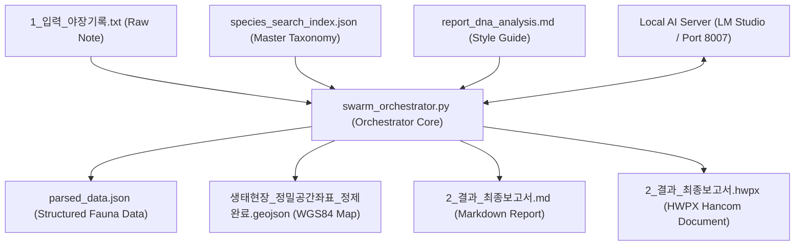
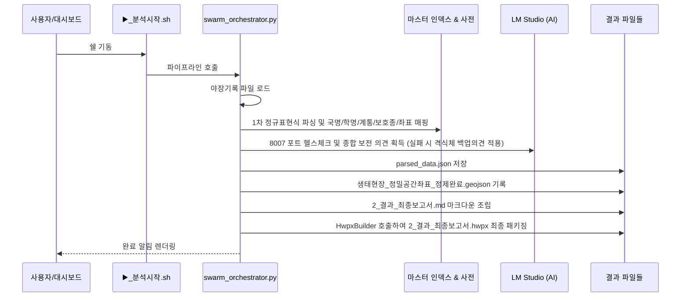

# fauna-workspace-core 기술 설계서 (Design Document)

> **요약**: 야장 수기 데이터 파싱, 마스터 계통 분류 대조, 지리 위경도 GeoJSON 공간화, 로컬 AI 종합의견 합성 및 한글 HWPX 보고서 빌드를 자동 오케스트레이션하는 백본 파이프라인 상세 설계.
>
> **프로젝트**: Fauna_Workspace
> **버전**: 1.0
> **작성자**: Antigravity AI
> **날짜**: 2026-05-31
> **상태**: Approved
> **기획서**: [fauna-workspace-core.plan.md](../../01-plan/features/fauna-workspace-core.plan.md)

---

## 1. 개요 (Overview)

### 1.1 기술 설계 목표
- **결정론적 초고속 파서 탑재**: 정규표현식 매칭을 적용하여 `1_입력_야장기록.txt` 내 모든 발견 항목을 0.1초 미만으로 파싱해 정량적 유실률 0% 달성.
- **분류학적 무결성**: 영명 계통 데이터베이스(`species_search_index.json`) 및 한글 목·과 사전을 매핑하여 생태 보고서 규격에 맞는 한글 계통분류학적 정제 수행.
- **실시간 지리 공간 GeoJSON 매핑**: 발견된 멸종위기종의 위경도(WGS84) 좌표를 자동 십진수화하여 `ingested_spatial_data.geojson` 및 `생태현장_정밀공간좌표_정제완료.geojson` 정밀 파일로 구축.
- **지능형 생태 의견 합성**: LM Studio 오프라인 감증 조건(Timeout 2초)을 고려한 하이브리드 보전 방안 의견 조율.

### 1.2 설계 원칙
- **Deterministic Separation**: 야장 분석의 정량적 정제는 100% 결정론적(Deterministic) 코드로 처리하며, AI 종합 의견 작성은 비결정론적(Probabilistic) 모델을 보완재로 설계함.
- **Clean Execution Loop**: 쉘 스크립트 실행 한 번으로 파이프라인의 전 과정을 수행하되 임시 파일을 발생시키지 않는 완전 소거형 트랜잭션 보장.

---

## 2. 아키텍처 (Architecture)

### 2.1 파이프라인 모듈 다이어그램 (Pipeline Component Diagram)


### 2.2 파이프라인 실행 시퀀스 (Execution Sequence Flow)


---

## 3. 데이터 모델 (Data Model)

### 3.1 파싱된 생태 레코드 데이터 모델 (Fauna Json Record Schema)
`parsed_data.json`에 영구 기록되는 데이터 레코드 구조 설계안입니다:

```typescript
interface FaunaStructuredRecord {
  surveyId: number;         // 조사 차수 (1, 2, 3, 4차...)
  species: string;          // 국명 종명 (예: 수달, 삵, 금개구리)
  traces: string;           // 발견 흔적 (V: 시각관찰, D: 사체, F: 흔적/배설물, S: 소리 등)
  count: number;            // 발견 개체수
  class: string;            // 대분류군 (포유류, 조류, 어류, 양서파충류, 저서무척추)
  protected: string | boolean; // 법적보호종 지정 여부 (등급 표기 또는 false/일반종)
  order: string;            // 계통 '목' 국명 (예: 식육목, 우제목, 무미목)
  family: string;           // 계통 '과' 국명 (예: 족제비과, 고양이과, 개구리과)
  scientificName: string;   // 생물학적 학명 (Scientific Name)
  latitude: number | null;  // 매핑된 조사지점 WGS84 위도 (Latitude)
  longitude: number | null; // 매핑된 조사지점 WGS84 경도 (Longitude)
}
```

### 3.2 공간 지리 데이터 규격 (GeoJSON Spatial Feature)
멸종위기 야생생물 GIS 매핑을 위해 생성되는 GeoJSON 포인트 레코드 명세입니다:

```json
{
  "type": "Feature",
  "properties": {
    "surveyId": 1,
    "species": "수달",
    "traces": "D",
    "count": 2,
    "class": "포유류",
    "protected": "멸종위기 Ⅰ급 / 천연기념물"
  },
  "geometry": {
    "type": "Point",
    "coordinates": [127.4851, 37.4912] // [경도, 위도] 표준 순서 준수
  }
}
```

---

## 4. 로컬 AI 서버 연동 API 명세 (AI Integration Specification)

### 4.1 LM Studio API 호출 규격

- **Base URL**: `http://127.0.0.1:8007/v1` (로컬 포트 8007 엔진)
- **Endpoint**: `POST /chat/completions`
- **Request Payload**:
  ```json
  {
    "model": "현재 활성화된 로컬 모델 ID",
    "messages": [
      {
        "role": "system",
        "content": "당신은 환경영향평가 최고 심의위원입니다... [보고서 DNA 스타일 가이드 동적 주입]"
      },
      {
        "role": "user",
        "content": "다음 생태 현지조사 결과를 종합 평가하여... [야장 요약 텍스트]"
      }
    ],
    "temperature": 0.3,
    "max_tokens": 1024
  }
  ```
- **오프라인 및 통신 예외 시 대응 로직**:
  - 모델 목록 조회 `GET /models` 호출 실패 또는 타임아웃 2초 경과 시, AI 서버 미구동 상태로 즉각 판단.
  - 사전에 조율된 고품질 저감대책 및 보전대책 의견 마스터 텍스트를 즉시 반환하여 딜레이 없이 프로세스 완결.

---

## 5. 보고서 조립 스키마 및 규칙 (Report Building Rules)

### 5.1 DNA 스타일 가이드 연동
- `report_dna_analysis.md` 마스터 가이드의 어조, 격식체(하십시오체, 평서문, 명료성)를 AI 프롬프트 본문에 동적으로 주입하여, 생성되는 보고서 종합의견이 국가 환경영향평가서 규격의 고품격 완성도를 갖추도록 함.
- **분류군 출력 순서 보장**: 보고서 내 생물상 도표 및 종합 결과 표 작성 시 반드시 **[포유류 -> 조류 -> 어류 -> 양서파충류 -> 저서무척추]** 순서로 하향식 렌더링되도록 계통 정렬을 오케스트레이터가 강제함.

---

## 6. 보안 및 리소스 소거 (Security & Resource Cleanup)
- **로컬 권한 및 안전 격리**: 본 파이프라인은 완전 로컬 시스템 권한으로 실행되며, 소스코드 내에 어떠한 인증정보(Credentials)나 원격 API 키를 고정하지 않고 환경 변수로 위임 관리함.
- **임시 파일 소거 규칙**: 파싱 및 보고서 빌딩 중 생성된 `analysis_temp` 하위 폴더의 임시 구조는 프로세스 종료 직전 및 에러 예외 발생 시 `finally` 블록을 활용하여 깨끗하게 제거함.

---

## 7. 검증 계획 (Test Plan)

| 검증 단계 | 검증 타겟 | 검증 방식 |
|------|--------|------|
| **단위 검증 (Unit)** | 야장 텍스트 정규표현식 파싱 | `1_입력_야장기록.txt`를 로드하여 빈 값, 주석 라인 등이 유실 없이 올바르게 무시되거나 파싱되는지 검증 |
| **통합 검증 (Integration)** | GeoJSON 좌표계 무결성 및 순서 검증 | WGS84 위도와 경도 데이터가 GeoJSON geometry 내 `[경도, 위도]`의 표준 지리학적 배열 순서로 올바르게 교차 기록되는지 검사 |
| **E2E 검증** | 원터치 기동 및 파일 생성 무결성 | `./▶️_분석시작.sh` 기동을 통해 `parsed_data.json`, `2_결과_최종보고서.md`, `생태현장_정밀공간좌표_정제완료.geojson` 파일들이 정상 시간 내에 자동 생성되는지 최종 확인 |

---

## 8. 구현 및 기동 가이드 (Implementation Guide)

### 8.1 실행 우선 순위
1. [x] **입력 수집**: `1_입력_야장기록.txt` 로드 구현.
2. [x] **결정론적 가공**: `swarm_orchestrator.py` 정규표현식 파서 및 마스터 사전 매핑 탑재.
3. [x] **지능형 합성**: LM Studio 연동 및 타임아웃 세션 예외 처리 연동.
4. [x] **보고서 팩 생성**: 최종 Markdown 및 HWPX 한글 보고서 패키지 조립.

---

## 버전 이력 (Version History)

| 버전 | 날짜 | 변경 사항 | 작성자 |
|---------|------|---------|--------|
| 1.0 | 2026-05-31 | 최초 설계 명세 확정 및 승인 | Antigravity AI |
