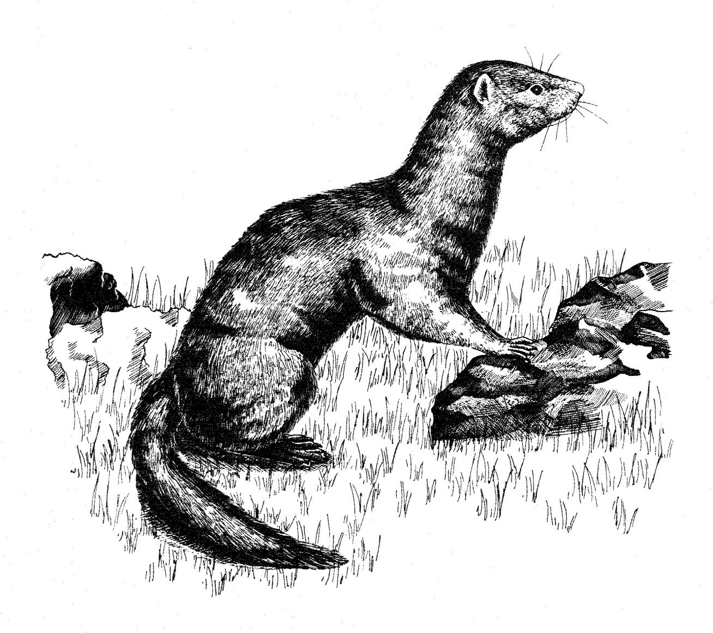
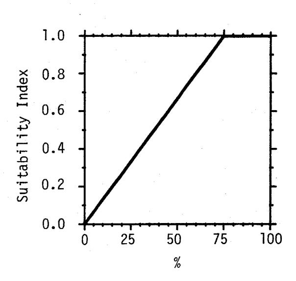
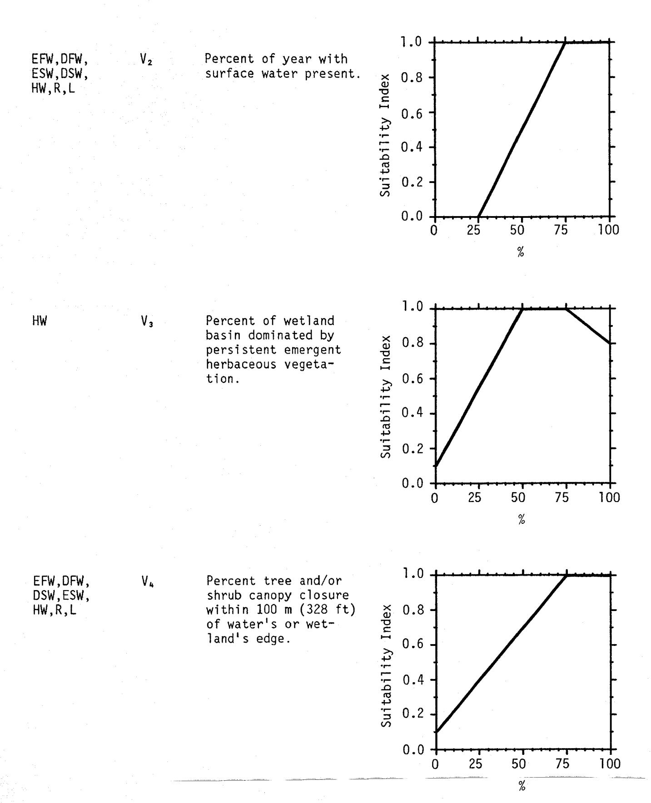
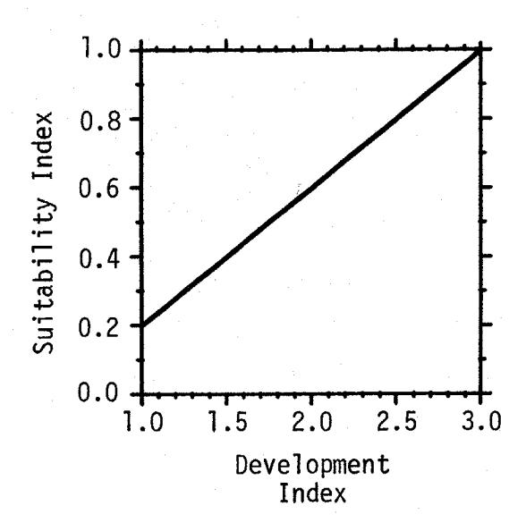
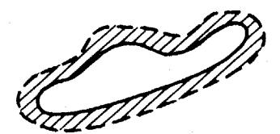
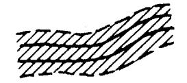
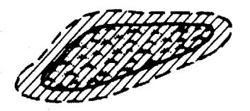
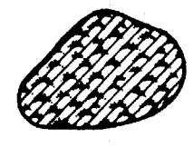

FWS/OBS-82/10.61 REVISED MAY 1984

# HABITAT SUITABILITY INDEX MODELS: MINK

# Fish and Wildlife Service

# i. Department of the Interior

SK 361 .U54 no. 82-10.61rev. HABITAT SUITABILITY INDEX MODELS: MINK

bу

Arthur W. Allen
Habitat Evaluation Procedures Group
Western Energy and Land Use Team
U.S. Fish and Wildlife Service
Drake Creekside Building One
2627 Redwing Road
Fort Collins, CO 80526-2899

Western Energy and Land Use Team
Division of Biological Services
Research and Development
Fish and Wildlife Service
U.S. Department of the Interior
Washington, DC 20240

This report should be cited as:

Allen, A. W. 1984. Habitat suitability index models: Mink. U.S. Fish Wildl. Serv. FWS/OBS-82/10.61 Revised. 19 pp.

#### **PREFACE**

This document is part of the Habitat Suitability Index (HSI) Model Series (FWS/OBS-82/10), which provides habitat information useful for impact assessment and habitat management. Several types of habitat information are provided. The Habitat Use Information Section is largely constrained to those data that can be used to derive quantitative relationships between key environmental variables and habitat suitability. The habitat use information provides the foundation for HSI models that follow. In addition, this same information may be useful in the development of other models more appropriate to specific assessment or evaluation needs.

The HSI Model Section documents a habitat model and information pertinent to its application. The model synthesizes the habitat use information into a framework appropriate for field application and is scaled to produce an index value between 0.0 (unsuitable habitat) and 1.0 (optimum habitat). The application information includes descriptions of the geographic ranges and seasonal application of the model, its current verification status, and a listing of model variables with recommended measurement techniques for each variable.

In essence, the model presented herein is a hypothesis of species-habitat relationships and not a statement of proven cause and effect relationships. Results of model performance tests, when available, are referenced. However, models that have demonstrated reliability in specific situations may prove unreliable in others. For this reason, feedback is encouraged from users of this model concerning improvements and other suggestions that may increase the utility and effectiveness of this habitat-based approach to fish and wildlife planning. Please send suggestions to:

Habitat Evaluation Procedures Group Western Energy and Land Use Team U.S. Fish and Wildlife Service 2627 Redwing Road Ft. Collins, CO 80526-2899

# CONTENTS

|                                       | Page     |
|---------------------------------------|----------|
| PREFACE                               | iii      |
| ACKNOWLEDGMENTS                       | ٧i       |
| HABITAT USE INFORMATION               | 1        |
| General                               | 1        |
| Food                                  | 1        |
| Water                                 | . 2      |
| Cover                                 | . 3 5 |
| Interspersion                         | 5        |
| HABITAT SUITABILITY INDEX (HSI) MODEL |          |
| Model Applicability                   | 6        |
| Model Description                     |          |
| Model Relationships                   | 11       |
| Application of the Model              | 14 16 |
| REFERENCES                            | 16       |

# **ACKNOWLEDGMENTS**

Dr. Johnny Birks, University of Durham, Durham, Great Britain; Dr. Paul Chanin, University of Exeter, Devon, Great Britain; Mr. Thomas Eagle, University of Minnesota, Minneapolis, MN; Mr. John Hunt, Maine Department of Inland Fisheries and Wildlife, Augusta, ME; Mr. Noel Kinler, Louisiana Department of Wildlife and Fisheries, New Iberia, LA; Mr. Ian Linn, University of Exeter, Hatherly Laboratories, Exeter, Great Britain; Mr. Greg Linscombe, Louisiana Department of Wildlife and Fisheries, New Iberia, LA; Mr. John Major, Maine Cooperative Wildlife Research Unit, University of Maine, Orono, ME; and Mr. Barry Saunders, Ministry of Environment, British Columbia, Canada; provided valuable critiques of earlier drafts of the HSI model for mink. The comments and suggestions of these individuals have added significantly to the quality of this HSI model, and their contributions are gratefully acknowledged. The cover of this document was illustrated by Jennifer Shoemaker. Word processing was provided by Carolyn Gulzow and Dora Ibarra.

# MINK (Mustela vison)

# HABITAT USE INFORMATION

#### General

The mink (<u>Mustela vison</u>) is a predatory, semiaquatic mammal that is generally associated with stream and river banks, lake shores, fresh and saltwater marshes, and marine shore habitats (Gerell 1970). Mink are chiefly nocturnal and remain active throughout the year (Marshall 1936; Gerell 1969; Burgess 1978). The species is adaptable in its use of habitat, modifying daily habits according to environmental conditions, particularly prey availability (Wise et al. 1981; Linn and Birks 1981; Birks and Linn 1982). The species is tolerant of human activity and will inhabit suboptimum habitats as long as an adequate food source is available; however, mink will be more mobile and change home ranges more frequently under such conditions (Linn pers. comm.).

#### Food

The mink's foraging niche is typically associated with aquatic habitats (Gerell 1969; Eberhardt and Sargeant 1977; Chanin and Linn 1980; Wise et al. 1981). The species exhibits considerable variation in its diet, according to season, prey availability, and habitat type (Burgess 1978; Chanin and Linn 1980; Melquist et al. 1981; Wise et al. 1981; Linscombe et al. 1982). Predation by mink in North Dakota appeared to be directed toward the most vulnerable individuals among available prey species (Sargeant et al. 1973). Preferred mink prey can be broadly categorized into three groups: (1) aquatic [e.g., fish and crayfish (Cambarus spp.)]; (2) semiaquatic [e.g., waterfowl and water associated mammals, such as the muskrat (Ondatra zibethicus)]; and (3) terrestrial (e.g., rabbits and rodents) (Chanin pers. comm.). If prey in any one of these categories is available throughout the year, the habitat may be suitable for mink.

Fish occurred more frequently (59%) in the mink's diet in Idaho than did any other prey category (Melquist et al. 1981). Unidentified cyprinids, ranging in length from 7 to 12 cm (2.7 to 4.7 inches) were the major group of prey fish. Larger fish, represented by salmonids, accounted for 9% of the diet. These larger fish were believed too large for mink to prey on and were probably scavenged. Fish, shellfish, and crustaceans were the major food items of mink inhabiting coastal habitats of Alaska and British Columbia (Harbo 1958 cited by Pendleton 1982, Hatler 1976).

Eberhardt and Sargeant (1977) reported that birds, mammals, amphibians, and reptiles accounted for 78%, 19%, 2%, and 1%, respectively, of the vertebrate prey consumed by mink in North Dakota prairie marshes. Waterfowl accounted for 86% of the avian prey, with coots (Fulica americana), ducks (Anseriformes), and grebes (Podicipediformes) comprising 70%, 11%, and 5%, respectively, of the total. The relative amount of each prey species eaten closely paralleled the relative abundance of the species. The high use of avian prey in North Dakota prairie marshes was believed to be a result of high waterfowl densities and the scarcity of other prey species, particularly fish and crayfish. Talent et al. (1983) concluded that predation by mink was the principle cause of duckling mortality in their North Dakota study. Waterfowl were also an important component of the diet of mink in Idaho during spring and early summer when young ducks were abundant (Melquist et al. 1981). Fish, crayfish, rodents, and birds are the principle prey of mink in Sweden (Gerell 1969). Fish are preferentially consumed in winter and spring due to their increased vulnerability, resulting from low water levels and low temperatures. Crayfish occurred most frequently in the mink's diet during the summer months in Sweden (Gerell 1967). Crayfish were also the most important component of the mink's summer diet in Quebec (Burgess 1978). Crayfish are a prominent component of the mink's diet in Louisiana and, when abundant, support high mink populations (Lowery 1974; Linscombe and Kinler pers. comm.). Mink populations in Louisiana are believed to cycle with, or slightly behind peaks in crayfish populations (Linscombe and Kinler pers. comm.).

With the approach of fall, small terrestrial mammals play an increasingly important role in the mink's diet (Gerell 1967, 1969; Burgess 1978). Small mammals associated with riparian habitats accounted for 43% of the mink's diet in Idaho (Melquist et al. 1981). Small mammals accounted for more than 20% of the fall/winter diet in North Carolina (Wilson 1954). Terrestrial prey species in Great Britain may be of equal importance in the mink's diet as are aquatic prey species (Birks pers. comm.). Rabbits may comprise up to 50% of the mink's diet even in areas where aquatic prey are abundant. Muskrats have been reported to be an important part of the mink's diet throughout its range (Hamilton 1940). Sealander (1943) reported that muskrats were a major component of the winter diet of mink in southern Michigan. However, Errington (1943) believed that muskrats became a significant food source for mink only during periods of muskrat overpopulation, epidemic diseases of muskrats, or Muskrats were the most important component of the mink's diet in drought. Ontario (McDonnell and Gilbert 1981). Predation on muskrats increased during the fall months as marsh water level decreased. Melquist et al. (1981) believed that only adult male mink were large enough to consistently prey upon muskrats.

#### Water

The majority of mink activity in Quebec was within 3 m (9.8 ft) of the edges of streams (Burgess 1978). All of the mink observations in a Michigan study were within 30.4 m (100 ft) of the water's edge (Marshall 1936). The majority of mink den sites recorded in a British study were within 10 m (32.8 ft) of the water's edge (Birks and Linn 1982). Mink den sites in Minnesota were within 69.9 m (200 ft) of open water (Schladweiler and Storm 1969). Den sites in Idaho were 5 to 100 m (16.4 to 328 ft) from water, and

mink were never observed further than 200 m (656 ft) from water (Melquist et al. 1981). Mink activity in Quebec dropped sharply as stream flow increased (Burgess 1978). Korschgen (1958) reported that the use of aquatic foods by mink in Missouri increased as water levels decreased.

# Cover

Mink in Michigan and Sweden are most commonly associated with brushy or wooded cover adjacent to aquatic habitats (Marshall 1936; Gerell 1970). Mink in a Quebec study were normally most active in wooded areas immediately adjacent to a stream channel (Burgess 1978). During the latter part of the summer, when terrestrial foods became a more significant component of the mink's diet. this relationship became less well defined. In England, mink movements of up to approximately 200 m (656 ft) from water are not uncommon, particularly when aquatic prey is scarce (Linn and Birks 1981). When upland habitats are used by mink, ecotones receive most use due to increased cover and small mammal availability. Mink generally avoid exposed or open areas (Gerell 1970; Burgess Shrubby vegetation furnishing a dense tangle provide suitable cover for mink (Linn pers. comm.). Grasses, even if very tall, do not provide adequate year-round cover for the species. However, harvest data in Louisiana suggests that marshes containing dense stands of sawgrass (Cladium jamaicense) support high densities of mink (Linscombe and Kinler pers. comm.). Thick stands of sawgrass are believed to provide excellent cover, elevation above the water level, and prey for mink. However, significantly more mink are captured in southern Louisiana swamps than marshes (Nichols and Chabreck The greater abundance of mink in cypress-tupelo (Taxodium distichum -Nyssa aquatica) swamps is partially attributed to a greater abundance of food resources and potential den sites than are present in marsh habitats. These findings are consistent with the belief that cypress-tupelo swamps are Louisiana's best mink producing areas (St. Amant 1959, cited by Nichols and Chabreck 1981). Gerell (1970) characterized mink habitat in Sweden as small. oligotrophic lakes with stony shores and streams surrounded by marsh vegetation. The shores of wetland habitats with dense vegetation are the most suitable mink habitat in Michigan (Marshall 1936) and England (Linn and Stevenson 1980). Virtually all mink locations recorded in a North Dakota study were within 20 m (66 ft) of emergent vegetation (Eagle pers. comm.). Evaluating duckling mortality in North Dakota, Talent et al. (1983) found that predation by mink typically occurred on semipermanent wetlands. Based on a lower rate of predation and less mink sign associated with seasonal wetlands. it was believed that semipermanent wetlands provided more suitable mink habitat than did less permanent wetland types. Wetlands with irregular and diverse shorelines provide more suitable mink habitat than do wetlands with straight, open, exposed shorelines (Croxton 1960; Waller 1962). Rapid declines in mink activity along Ontario lake shores were recorded where relatively small increases in human development had taken place (Racey and Euler 1983). The construction of cottages adjacent to lake shorelines typically resulted in reduced vegetative cover and diminished shoreline complexity due to the removal of snags, stones, aquatic vegetation, and the development of sand beaches. The decreased complexity of shoreline habitats was believed to reduce the amount of shelter available to crayfish resulting in decreased mink prey availability. Habitats associated with small streams are preferred to those

associated with large, broad rivers (Davis 1960). Mink are most common along streams where there is an abundance of downfall or debris for cover and pools for foraging. Log jams provide excellent foraging cover for mink because they provide shelter for aquatic organisms and security for mink (Melquist et al. 1981). Burgess (1978) recorded a 52.5% increase in mink activity along a stream reach in Quebec that had undergone habitat improvement. Stream alterations consisted of the creation of pools up to 1 m (3.38 ft) deep in 50% of the stream channel and the placement of logs and other cover within the channel. Dunstone and O'Connor (1979) attributed the mink's use of stream and lake edges to the inability of mink to efficiently forage in open water. Cover associated with aquatic ecotones allowed a stealthier approach and development of specific search strategies by mink (Dunstone 1978). Open water was believed to provide potentially suitable foraging areas only during periods of reduced water volume or high fish density.

The availability of suitable dens may limit the ability of a habitat to support mink (Errington 1961; Gerell 1970; Northcott et al. 1974; Birks and Linn 1982). The absence of dry den sites may limit the mink's use of some wetlands (Linn pers. comm.). Mink typically select den sites that are close to preferred foraging areas or concentrations of prey items (Linn and Birks 1981; Melquist et al. 1981; Birks and Linn 1982). Mink use several dens within their home range for concealment, shelter, and litter rearing (Marshall 1936; Schladweiler and Storm 1969; Gerell 1970; Eberhardt 1973; Eberhardt and Sargeant 1977; Linn and Birks 1981; Melquist et al. 1981; Birks and Linn 1982). Maximum consecutive days of occupation of single dens in North Dakota was approximately 40 days (Eberhardt and Sargeant 1977). After kits became more mature, individual dens were used briefly and irregularly. The majority of den stays in England were less than 1 day in duration (Birks and Linn 1982). The mean distance covered for 12 den moves in North Dakota was 234 m (767.5 ft) (Eberhardt and Sargeant 1977). The mean distance between dens used for two or more consecutive days in Sweden was 544 m (1784.3 ft) (Gerell 1970). The mean inter-den distance recorded in England was 492.2 m (1614.9 ft) (Birks and Linn 1982). Movements of male mink to new den sites tended to be greater than those recorded for females of the species. New mink dens in Wisconsin were usually within 90 m (295 ft) of the previous den site (Schladweiler and Storm 1969). The majority of inter-den movements are made at night and typically occur in, or along, linear habitat features such as lake shores, river banks, stream courses, or hedge-rows (Birks and Linn 1982). Gerell (1970) reported that the most "commonly" used dens were located in cavities beneath tree roots at the water's edge. However, "more preferred", but less common, den sites were within cavities or piles of rocks well above the water line. Birks and Linn (1982) also identified cavities within, or beneath, waterside trees as being an important source of den sites for mink. Mink dens adjacent to lake shorelines in Ontario were located in sites with higher than average numbers of deadfalls and stumps and greater shrub and tree stem densities (Racey and Euler 1983). Log jams accounted for 53% of the mink dens located in Idaho (Melquist et al. 1981). Fallen branches, brush, and other debris provided additional den sites. The use of log jams increased during December, probably as a result of decreased accessibility to other den sites due to increasing snow depth. All mink dens located in North Dakota were situated on marsh shorelines and appeared to be in abandoned or seldom used muskrat burrows (Eberhardt 1973; Sargeant et al. 1973; Eberhardt and Sargeant 1977). The availability of dens for mink use was believed to be related to the suitability of the wetland for muskrats and the amount of shoreline grazing by livestock. Active mink dens were not located on heavily grazed shorelines. Errington (1954) characterized prime mink habitat in the northcentral region of the United States as being choice muskrat habitat. Extremely high mink harvests have occurred in association with high muskrat populations in Louisiana (Linscombe and Kinler pers. comm.). The highest densities of muskrats in Louisiana occur in association with bulrush (Scirpus olneyi).

#### Reproduction

No information relating specifically to habitat needs for reproduction was found in the available literature.

#### Interspersion

The home ranges of mink tend to approximate the shape of the water body along which they live (Gerell 1970; Linn and Birks 1981). A mink's use of its home range varies in intensity due to varying prey availability. During daily activity periods, mink move back and forth in a restricted "core area" which typically does not exceed 300 m (984 ft) in shoreline length (Gerell 1970). Eventually, the mink will use another den within the home range as a base and will intensively forage within an associated core area. Linn and Birks (1981) found that the mink's home range in England typically contained one or two core areas that were associated with prey concentrations. Although core areas generally occupied a small proportion (mean = 9.3%) of the home range area, mink spent approximately 50% of their time within these areas (Birks and Linn 1982). When prey was abundant throughout the home range, the core areas were not as well defined. When the aquatic aspect of the habitat was nonlinear (e.g., marshes), the home range was smaller and less linear in shape. The mink's use of its home range also shows temporal variation in response to seasonal differences in prey availability (Birks and Linn 1982). Movements recorded in England indicated a general reduction in activity in winter relative to summer. Fewer den sites were used, occupancy at individual dens were of longer duration, and daily travel distances were shorter. Mink home range size in British Columbia was believed to be inversely related to the quality of forage areas (Hatler 1976). The overall mink population was believed to be limited by the number of high quality, year-long foraging areas. Harbo (1958 cited by Pendleton 1982) attributed higher mink populations and smaller activity areas along coastal Alaska to a relatively consistent year-long food supply in the intertidal zone.

Vegetative cover had a significant impact on mink home range size in Montana (Mitchell 1961). The home range size for female mink within a heavily vegetated area was estimated to be 7.7 ha (19.3 acres), while the home range of a female within a sparsely vegetated, heavily grazed area was 20.1 ha (50.2 acres). Female mink home ranges in Michigan did not exceed 8 ha (20 acres) (Marshall 1936). Mink in Idaho were believed to be able to sustain

themselves in a 1 to 2 km (0.6 to 1.2 miles) section of stream length (Melquist et al. 1981). Mink population densities along the coast of Vancouver Island ranged from 1.5 to more than 3 animals/km (1.5 to 3/0.6 mi) of shoreline (Hatler 1976). Mink home range size in the prairie pothole region of North Dakota ranged from 2.59 km² to 3.8 km² (1 to 1.5 mi²) and typically included numerous wetlands (Eagle pers. comm.). Female mink have the smallest and most well defined home range, while those of males tend to be more extensive and less well defined (Marshall 1936). The home range size for female mink in England was, on an average, 85.4% of a male's home range size (Birks and Linn 1982). Intrasexual and intersexual home range overlap was rare in a North Dakota study except during the 2 to 3 week breeding season in April (Eagle pers. comm.). Female mink in Sweden were found to be more restricted to riparian habitats while males transiently exploited upland areas (Gerell 1970). Male mink in England tended to forage away from aquatic habitats while females typically remained in close proximity to water (Birks and Linn 1982). Mink concentrating on aquatic prey tended to utilize larger core areas than individuals exploiting terrestrial prey species. Solely terrestrial foraging was exclusively a male activity and typically occurred where aquatic prey and prey associated with riparian habitats were scarce.

HABITAT SUITABILITY INDEX (HSI) MODEL

## Model Applicability

Geographic area. This HSI model has been developed for application within inland wetland habitats throughout the range of the species.

<u>Season</u>. This HSI model was developed to evaluate the potential quality of year-round habitat for the mink.

Cover types. This model was developed to evaluate habitat in the following cover types (terminology follows that of U.S. Fish and Wildlife Service 1981): Evergreen Forested Wetland (EFW); Deciduous Forested Wetland (DFW); Evergreen Scrub-shrub Wetland (ESW); Deciduous Scrub-shrub Wetland (DSW); Herbaceous Wetland (HW); Riverine (R); and Lacustrine (L).

Minimum habitat area. Minimum habitat area is defined as the minimum amount of contiguous habitat that is required before an area will be occupied by a species. Information on the minimum habitat area for the mink was not found in the literature. The size and shape of mink home ranges vary in response to topography, food availability, and sex. Although home ranges of female mink are smaller than those of males, home ranges of both sexes tend to parallel the configuration of a body of water or wetland basin. Based on this information, it is assumed that any wetland, or wetland associated habitat, large enough to be identified and evaluated as such, has the potential to support mink.

<u>Verification level</u>. This HSI model provides habitat information useful for impact assessment and habitat management. The model is a hypothesis of species-habitat relationships and does not reflect proven cause and effect

relationships. Earlier drafts of this model have been reviewed by Dr. Johnny Birks, University of Durham, Durham, Great Britain; Dr. Paul Chanin, University of Exeter, Devon, Great Britain; Mr. Thomas Eagle, University of Minnesota, Minneapolis, MN; Mr. John Hunt, Maine Department of Inland Fisheries and Wildlife, Augusta, ME; Mr. Noel Kinler, Louisiana Department of Wildlife and Fisheries, New Iberia, LA; Mr. Ian Linn, University of Exeter, Hatherly Laboratories, Exeter, Great Britain; Mr. Greg Linscombe, Louisiana Department of Wildlife and Fisheries, New Iberia, LA; Mr. John Major, Maine Cooperative Wildlife Research Unit, University of Maine, Orono, ME; and Mr. Barry Saunders, Ministry of Environment, British Columbia, Canada. Improvements and modifications suggested by these individuals have been incorporated into this model.

#### Model Description

Overview. The year-round habitat requirements of mink can be satisfied within wetland, riverine, or lacustrine cover types if sufficient vegetation or cover is present to support an adequate prey base. Although not totally restricted to wetland or wetland-associated habitats, the mink is dependent on aquatic organisms as a food source for a large portion of the year. Transient use of upland habitats may occur, particularly during the fall and winter months, when terrestrial prey plays an increasingly important role in the mink's diet. The majority of mink activity (foraging, establishment of dens, and litter rearing) occurs in close proximity to open water. This model assumes that sufficient vegetative cover must be interspersed with, or adjacent to, relatively permanent surface water to provide the maximum potential as mink habitat. It is assumed, in this model, that quality food and cover for the mink can be described by the same set of habitat characteristics. The reproductive habitat requirements of the mink are assumed to be identical to its cover habitat requirements.

The following sections provide documentation of the logic and assumptions used to translate habitat information for the mink to the variables and equations used in the HSI model. Specifically, these sections cover: (1) identification of variables used in the model; (2) definition and justification of the suitability levels of each variable; and (3) description of the assumed relationships between variables.

Figure 1 illustrates the relationships of habitat variables, life requisites, and cover types for the mink.

Food component. Mink are not totally dependent on aquatic or wetland-associated prey species. However, these species form the largest portion of the annual diet. It is assumed that surface water must be present for a minimum of nine months of the year to provide optimum foraging habitat for mink. Habitats with less permanent surface water are assumed to be less suitable mink habitat. Wetland habitats consisting only of saturated soils, or lacking surface water, are assumed to be of no value as year-round mink habitat.

| Habitat variable                                                                                                                          | <u>Life requisite</u> | Cover types                                                                             |                |
|-------------------------------------------------------------------------------------------------------------------------------------------|-----------------------|-----------------------------------------------------------------------------------------|----------------|
| Percent tree, shrub and/or persistent ———————————————————————————————————                                                                 |                       |                                                                                         |                |
| Percent tree and/or shrub canopy closure within 100 m (328 ft) from water's or wetland's edge.                                      | Food/cover            | Deciduous forested  Wetland Evergreen scrub/shrub Wetland Wetland Deciduous scrub/shrub | <u>-</u>       |
| Percent of year with surface water                                                                                                        |                       | wetland                                                                                 |                |
| Percent of wetland basin dominated by persistent emergent herbaceous vegetation.                                                          | Food/cover            | - Herbaceous wetlandHSI                                                                 | - <del>S</del> |
| Percent tree and/or shrub canopy closure within 100 m (328 ft) from water's or wetland's edge. Shoreline development factor.              | > Food/cover          | - Lacustrine                                                                            | <del>-</del>   |
| Percent of year with surface water present.  Percent tree and/or shrub canopy cover within 100 m (328 ft) from water's or wetland's edge. | > Food/cover          | - Riverine                                                                              | - -         |

Figure 1. Relationships of habitat variables, life requisites, and cover types in the mink HSI model.

Several reviewers of this model have commented that eutrophic lakes have greater potential productivity than do oligotrophic lakes. Due to a more diverse and abundant aquatic prey base eutrophic lakes may be capable of supporting larger populations of mink. The primary productivity of a lake is dependent in part upon the nutrients received from the surrounding drainage, geological age, and water depth. Oligotrophic lakes are typically deep, with the hypolimnion larger than the epilimnion, littoral zone vegetation is scarce and organic content and plankton density are low. In contrast, eutrophic lakes are typically shallow, have high concentrations of plant nutrients (e.g., nitrogen, phosphorus), have high organic content, and littoral zone vegetation is generally abundant. Although this model does not take into account a specific evaluation of a lake's potential ability to produce food organisms, it should be realized that potential food production and a lake's ability to provide abundant aquatic prey for mink may vary based on the lake's physical and chemical structure.

Small terrestrial mammals become a more important component of the diet during the fall and winter months. Sufficient terrestrial vegetative cover interspersed with, or immediately adjacent to, water is assumed to provide an adequate source of prey species to supplement the aquatic portion of the mink's diet.

Cover component. Although mink will occasionally use upland habitats, they are most often found in close association with wetland cover types and the vegetative communities immediately adjacent to streams, rivers, and lakes. Dense woody cover provided by trees and/or shrubs provides the mink with potential den sites, escape cover, and foraging cover. Persistent herbaceous cover may also provide mink with sufficient cover for foraging and shelter. It is assumed that terrestrial herbaceous vegetation by itself will not provide sufficient cover for the mink during winter.

Suitable mink habitat within forested or scrub/shrub wetlands is assumed to be a function of the total canopy closure of shrubs, trees, and persistent emergent herbaceous vegetation within the wetland basin. Optimum conditions for cover, denning, and foraging are assumed to occur when the canopy closure of woody and persistent herbaceous vegetation exceeds 75%. Forested or scrub/ shrub wetlands with lower vegetative canopy closures are assumed to be less suitable mink habitat. Woody vegetation within 100 m (328 ft) of a wetland's edge is assumed to also influence the potential quality of mink habitat. However, the degree to which vegetative quality in a 100 m (323 ft) band surrounding a forested or scrub/shrub wetland influences the potential habitat quality for mink is dependent on the wetland basins' size. In small forested or scrub/shrub wetlands the adjacent upland cover is assumed to play a relatively important role in defining overall habitat quality for the species. In contrast, the majority of mink inhabiting large, expansive forested or shrub wetlands probably do not utilize, nor are they influenced by the quality of adjacent upland habitats. In large forested or shrub wetlands potential habitat quality for mink is assumed to be a function only of the amount of woody and persistent herbaceous vegetation and the percent of the year with surface water present. Within small, or linear, forested, scrub/shrub wetland basins potential habitat quality is assumed to be a function of the canopy closure of woody and persistent herbaceous vegetation in the wetland basin, the percent of the year with surface water present, and the canopy closure of woody vegetation in a 100 m (328 ft) band adjacent to the wetland basin. For the purposes of this model, large wetland basins are assumed to be 405 ha (1,000 acres) or larger in size. However, this is an arbitrary figure used to separate small and large wetlands for application of the model. Users may wish to redefine this value based on experience with regional habitat classifications.

Suitable cover for mink in herbaceous wetlands is assumed to be a function of the amount of the wetland basin supporting persistent emergent herbaceous vegetation (e.g., cattails and rushes) and, to a lesser extent, the amount of woody cover immediately adjacent to the herbaceous wetland. Optimum cover conditions for mink in herbaceous wetlands are assumed to occur when the wetland basin consists of 50 to 75% persistent emergent herbaceous vegetation. Herbaceous wetlands with greater than 75% canopy cover of persistent emergent vegetation are assumed to provide lower prey diversity and have slightly less potential in meeting the year-round food requirements of mink. Less than 50% persistent emergent vegetation is assumed to be indicative of less suitable mink habitat. Wetlands totally devoid of persistent emergent vegetation are assumed to have minimum value as year-round mink habitat. The cover value for mink in herbaceous wetlands may be improved if woody vegetation is present within 100 m (328 ft) of the wetland's edge. However, the presence of persistent emergent vegetation is assumed to be the major characteristic defining potential mink habitat in herbaceous wetlands and has been weighted to reflect this assumption. As in the case of forested and shrub wetlands, the presence of surface water within herbaceous wetlands has a direct influence on the habitat potential for mink. Wetlands with surface water present for three months or less are assumed to be unsuitable habitat, while wetlands with surface water present nine months, or longer, are assumed to be indicative of optimum conditions.

The quality of cover for mink in lacustrine habitats is assumed to be a function of the percent tree and/or shrub canopy closure within 100 m (328 ft) of the water's edge and the shape of the lake basin. A canopy closure of 75% or more of woody vegetation is assumed to characterize optimum vegetative cover. Cover quality is assumed to decrease as the density of woody vegetation decreases. However, because mink will utilize burrows, rock crevices and other forms of temporary shelter, the complete absence of woody vegetation is assumed to not totally limit an area's potential as mink habitat. Greater shoreline development (e.g., complexity) is assumed to reflect more suitable habitat conditions for the mink and its major aquatic prey species. Lakes with irregular and diverse shorelines are assumed to provide higher quality mink habitat than lakes with straight shores or lakes that are roughly circular in shape. The presence of peninsulas, islands, or inlets increases the shoreline edge and is assumed to provide more suitable access and foraging sites for the mink.

Within riverine cover types, suitable cover for mink is assumed to be related to the density of woody vegetation (trees and/or shrubs) within 100 m (328 ft) of the water's edge. Optimum conditions are assumed to exist when

the canopy closure equals or exceeds 75%. Lower cover quality is characterized by less dense stands of woody vegetation adjacent to the river or stream channel. While optimum cover conditions are assumed to occur in riverine habitats bordered by trees and/or shrubs, the complete absence of woody vegetation is assumed to not totally limit the cover value. Minimum cover potential is assumed to exist in habitats devoid of woody vegetation based on the mink's use of other forms of shelter (e.g., rock crevices, animal burrows).

The vegetative cover values in all cover types used by mink are modified by the relative permanence of surface water, as discussed in the  $\frac{Food\ component}{Food\ component}$  section of this model. Even though the vegetative characteristics of a cover type may be of optimum value, it is assumed that mink habitat will not be present if surface water is not available. To provide optimum mink habitat, surface water must be present for a minimum of 9 months of the year.

#### Model Relationships

Suitability Index (SI) graphs for habitat variables. The relationships between various conditions of habitat variables and habitat suitability for the mink are graphically represented in this section.

| Cover type       | <u>Variable</u> |                                                                                       |
|---------------------|-----------------|---------------------------------------------------------------------------------------|
| EFW,DFW, ESW,DSW | V 1  | Percent tree, shrub, and/or persistent emergent herbaceous vegetation canopy closure. |

Vs Shoreline development factor.

Equations. In order to obtain life requisite values for the mink, the SI values for appropriate variables must be combined through the use of equations. A discussion and explanation of the assumed relationships between variables was included under Model Description, and the specific equations in this model were chosen to mimic these perceived biological relationships as closely as possible. The suggested equations for obtaining a food/cover value are presented by cover type in Figure 2.

| Life requisite | Cover type                                             | Equations                    |
|----------------|--------------------------------------------------------|------------------------------|
| Food/cover     | EFW,DFW,ESW,DSW [< 405 ha (1,000 acres) in size] | $V_2 = \frac{V_1 + V_4}{2}$  |
| Food/cover     | EFW,DFW,ESW,DSW [≥ 405 ha (1,000 acres) in size] | $(V_1 \times V_2)^{1/2}$     |
| Food/cover     | HW .                                                   | $V_2 = \frac{4V_3 + V_4}{5}$ |
| Food/cover     | L                                                      | $(V_4 \times V_5)^{1/2}$     |
| Food/cover     | R                                                      | $(V_2^2 \times V_4)^{1/3}$   |

Figure 2. Equations for determining life requisite values by cover type for the mink.

 $\underline{\mathsf{HSI}}$  determination. Because food/cover was the only life requisite considered in this model, the HSI equals the food/cover value determined for a specific cover type.

## Application of the Model

Potential mink habitat must contain a relatively permanent source of surface water. Because of the mink's use of upland habitats for denning and foraging, optimum mink habitat must also contain suitable cover adjacent to the water body or wetland. Therefore, the application of this model and the determination of habitat units is based on an evaluation of the quality of the wetland, lacustrine, or riverine cover type and a 100 m (328 ft) band of habitat surrounding the aquatic portion of the habitat. Figure 3 illustrates the relationship of cover types to the suggested evaluation area.

#### Cover type

#### Lacustrine

HSI determined only for area contained within 100 m (328 ft) band around lake.

#### Riverine

HSI determined for area within 100 m band on both sides of river plus area of river.

Palustrine (herbaceous wetlands, forested wetlands, or shrub wetlands). Less than 405 ha (1,000 acres) in size.

HSI determined for area contained within cover type plus area within 100 m band around wetland cover type.

Palustrine (forested wetlands or shrub wetlands) 405 ha (1,000 acres) or larger in size HSI determined for area contained only within cover type.

#### Area for evaluation

Figure 3. Guidelines for determining the area to be evaluated for mink habitat suitability under various cover type conditions.

Definitions of variables and suggested field measurement techniques (Hays et al. 1981) are provided in Figure 4.

| Varia          | ble (definition)                                                                                                                                                                                                                                                                                                    | Cover types                | Suggested technique            |
|----------------|---------------------------------------------------------------------------------------------------------------------------------------------------------------------------------------------------------------------------------------------------------------------------------------------------------------------|----------------------------|--------------------------------|
| V 1 | Percent tree, shrub, and/or persistent emergent herbaceous canopy closure [the percent of the ground surface that is shaded by a vertical projection of the canopies of all woody vegetation and herbaceous vegetation which normally remains standing after the growing season (e.g., cattails and/or bulrushes)]. | EFW,DFW,ESW, DSW        | Line intercept, remote sensing |
| V 2 | Percent of the year with surface water present (the proportion of the year in which wetland cover types have surface water present).                                                                                                                                                                                | EFW,DFW,ESW, DSW,HW,R,L | Remote sensing, local data     |
| V 3 | Percent of wetland basin dominated by persistent emergent vegetation [e.g., the proportion of a wetland that supports emergent herbaceous vegetation which normally remains standing after the growing season (e.g., cattails and/or bulrushes)].                                                                   | HW                         | Remote sensing                 |
| ٧.,            | Percent tree and/or canopy closure within 100 m (328 ft) of the water's or wetland's edge [the percent of the ground surface within 100 m (328 ft) of the water's edge, or edge of a wetland, that is shaded by a vertical projection of the canopies of all woody vegetation].                                     | EFW,DFW,ESW, DSW,HW,R,L | Remote sensing, line intercept |

Figure 4. Definitions of variables and suggested measurement techniques.

## Variable (definition)

## Cover types

L

# Suggested technique

V5 Shoreline development factor (a ratio relating the relative edge of a water body to its area. To obtain a value for shoreline development, measure the length of the shoreline and the area of the water body. The ratio of shoreline to area is compared to that for a circle having the same area

Remote sensing, topographic map. Dot grid, planimeter.

$$DI = \frac{1}{2\sqrt{A\pi}}$$

as the water body, using the following formula:

where:

DI = diversity index
1 = length of shoreline
A = area of water body

A circle would have a value equal to 1.0. The greater the deviation from a circular shape, the greater the DI value will be).

Figure 4. (concluded).

#### SOURCES OF OTHER MODELS

No other habitat models for the mink were located in the literature.

#### **REFERENCES**

Birks, J. Personal communication (letter dated 16 August 1983). University of Durham Science Laboratories, Durham, Great Britain.

Birks, J. D. S., and I. J. Linn. 1982. Studies of home range of the feral mink, (Mustela vison). Symp. Zoo. Soc. Lond. 49:231-257.

- Burgess, S. A. 1978. Aspects of mink (<u>Mustela vison</u>) ecology in the Southern Laurentains of Quebec. M.S. Thesis, MacDonald College of McGill Univ. Montreal, Quebec. 112 pp.
- Chanin, P. R. F. Personal communication (letter dated 5 August 1983). University of Exeter, Devon, Great Britain.
- Chanin, P. R. F., and I. Linn. 1980. The diet of the feral mink (Mustela vison) in southwest Britain. J. Zool., Lond., 192:205-223.
- Croxton, L. W. 1960. Southeastern mink management studies. Alaska Dept. Fish and Game. Pittman-Robertson Proj. Rep. Annu. Rep. of Prog. 1959/60:366-371.
- Davis, W. B. 1960. Mammals of Texas. Texas Fish and Oyster Comm. Bull. 41.
- Dunstone, N. 1978. The fishing strategy of the mink (<u>Mustela</u> <u>vison</u>); timebudgeting of hunting effort? Behaviour 67(3-4):157-177.
- Dunstone, N., and R. J. O'Connor. 1979. Optimal foraging in an amphibious mammal. I. The aqualung effect. Anim. Behav. 27(4):1182-1194.
- Eagle, T. C. Personal communication (letter dated 24 March 1983). University of Minnesota, Minneapolis.
- Eberhardt, R. T. 1973. Some aspects of mink-waterfowl relationships on prairie wetlands. Prairie Nat. 5(2):17-19.
- Eberhardt, R. T., and A. B. Sargeant. 1977. Mink predation on prairie marshes during the waterfowl breeding season. Pages 33-43 in R. L. Phillips and C. Jonkel, eds. Proc. 1975 Predator Symp., Montana For. and Conserv. Exp. Stn., Univ. Montana, Missoula.
- Errington, P. L. 1943. An analysis of mink predation upon muskrats in north-central United States. Iowa Agric. Exp. Stn. Res. Bull. 320:797-924.
- \_\_\_\_\_. 1954. The special responsiveness of minks to epizootics in muskrat populations. Ecol. Monogr. 24:377-393.
- \_\_\_\_\_. 1961. Muskrats and marsh management. Stackpole Co., Harrisburg, PA. 183 pp.
- Gerell, R. 1967. Food selection in relation to habitat in mink (<u>Mustela vison</u> Schreber) in Sweden. Oikos 18(2):233-246.
- . 1969. Activity patterns of the mink <u>Mustela</u> <u>vison</u> Schreber in southern Sweden. Oikos 20(2):451-460.
- Schreber in southern Sweden. Oikos 21(2):160-173.

- Hamilton, W. J. 1940. The summer food of minks and raccoons on the Montezuma Marsh, New York. J. Wildl. Manage. 4(1):80-84.
- Harbo, S. J. 1958. An investigation of mink in interior and southeastern Alaska. M.S. Thesis, Univ. Alaska, Fairbanks. 108 pp. (Cited by Pendleton 1982).
- Hatler, D. F. 1976. The coastal mink on Vancouver Island, British Columbia. Ph.D. Diss. Univ. British Columbia, Vancouver.
- Hays, R. L, C. S. Summers, and W. Seitz. 1981. Estimating wildlife habitat variables. U.S. Dept. Int., Fish Wildl. Serv. FWS/OBS-81/47. 173 pp.
- Korschgen, L. J. 1958. December food habits of mink in Missouri. J. Mammal. 39(4):521-527.
- Linn, I. J. Personal communication (letter dated 3 August 1983). University of Exeter, Hatherly Laboratories, Exeter, Great Britain.
- Linn, I., and J. H. F. Stevenson. 1980. Feral mink in Devon. Nature in Devon 1:7-27.
- Linn, I. J., and J. D. S. Birks. 1981. Observations on the home ranges of feral American mink (<u>Mustela vison</u>) in Devon, England as revealed by radio-tracking. Pages 1088-1102 in J. A. Chapman and D. Pursley, eds. Worldwide Furbearer Conf. Proc., Vol. I, Aug. 3-11, Frostberg, MD.
- Linscombe, G., N. Kinler, and R. J. Aulerich. 1982. Mink <u>Mustela vision</u>. Pages 629-643 <u>in</u> J. A. Chapman and G. A. Feldhamer, eds. <u>Wild mammals of North America</u>: Biology, Management, and Economics. Johns Hopkins Univ. Press, Baltimore, MD. 1,147 pp.
- Linscobme, G., and N. Kinler. Personal communication (letter dated 17 August 1983). Louisiana Department of Wildlife and Fisheries, Route 4, Box 78, New Iberia, LA.
- Lowery, G. N., Jr. 1974. The mammals of Louisiana and its adjacent waters. Louisiana State Univ. Press, Baton Rouge, LA. 565 pp.
- Marshall, W. H. 1936. A study of the winter activities of the mink. J. Mammal. 17(4):382-392.
- McDonnell, J. A., and F. F. Gilbert. 1981. The responses of muskrats (<u>Ondatra zibethicus</u>) to water level fluctuations at Luther Marsh, Ontario. Pages 1027-1040 in J. A. Chapman and D. Pursley, eds. Worldwide Furbearer Conf. Proc., Vol. I, Aug. 3-11, Frostberg, MD.
- Melquist, W. E., J. S. Whitman, and M. G. Hornocker. 1981. Resource partitioning and coexistence of sympatric mink and river otter populations. Pages 187-220 in J. A. Chapman and D. Pursley, eds., Worldwide Furbearer Conf. Proc., Vol. I, Aug. 3-11, 1980, Frostberg, MD.

- Mitchell, J. L. 1961. Mink movements and populations on a Montana river. J. Wildl. Manage. 25(1):48-54.
- Nichols, J. D., and R. H. Chabreck. 1981. Comparative fur harvests of swamp and marsh wetlands in southern Louisiana. Pages 273-387 in J. A. Chapman and D. Pursley, eds. Worldwide Furbearer Conf. Proc., Vol. I, Aug. 3-11, Frostberg, MD.
- Northcott, T. H., N. F. Payne, and E. Mercer. 1974. Dispersal of mink in insular Newfoundland. J. Mammal. 55(1):243-248.
- Pendleton, G. W. 1982. A selected annotated bibliography of mink behavior and ecology. S. Dak. Coop. Wildl. Res. Unit, Brookings. Tech. Bull. 3.
- Racey, G. D., and D. L. Euler. 1983. Changes in mink habitat and food selection as influenced by cottage development in central Ontario. J. Appl. Ecol. 20(2):387-402.
- Sargeant, A. B., G. A. Swanson, and H. A. Doty. 1973. Selective predation by mink, Mustela vison, on waterfowl. Am. Midl. Nat. 89(1):208-214.
- Schladweiler, J. L., and G. L. Storm. 1969. Den-use by mink. J. Wildl. Manage. 33(4):1025-1026.
- Sealander, J. A. 1943. Winter food habits of mink in southern Michigan. J. Wildl. Manage. 7(4):411-417.
- St. Amant, L. S. 1959. Louisiana wildlife inventory and management plan. Louisiana Wildl. Fish. Comm. New Orleans, LA. (cited by Nichols and Chabreck 1982).
- Talent, L. G., R. L. Jarvis, and G. L. Krapu. 1983. Survival of mallard broods in south-central North Dakota. Condor 85:74-78.
- U.S. Fish and Wildlife Service. 1981. Standards for the development of habitat suitability index models. 103 ESM. U.S. Dept. Int., Fish Wildl. Serv., Div. Ecol. Serv. n.p.
- Waller, D. W. 1962. Feeding behavior of minks at some Iowa marshes. M.S. Thesis, Iowa State Univ., Ames. 90 pp.
- Wilson, K. A. 1954. The role of mink and otter as muskrat predators in northeastern North Carolina. J. Wildl. Manage. 18(2):199-207.
- Wise, M. H., I. J. Linn, and C. R. Kennedy. 1981. A comparison of the feeding biology of mink (<u>Mustela vison</u>) and otter (<u>Lutra lutra</u>). J. Zool., Lond. 195:181-213.

| EPUKI      | DOCUMENTATION PAGE                                                                               | 1 REPORT NO. FWS/OBS-82/10.61 REVISED                                                                                                                                   | 2.                                                                                                            | 3. Recipient's Accession No.                                                |
|------------|--------------------------------------------------------------------------------------------------|----------------------------------------------------------------------------------------------------------------------------------------------------------------------------|---------------------------------------------------------------------------------------------------------------|-----------------------------------------------------------------------------|
| Title and  |                                                                                                  |                                                                                                                                                                            | ·                                                                                                             | 5. Report Date                                                              |
|            | Habitat Suita                                                                                    | bility Index Models: Mink                                                                                                                                                  |                                                                                                               | May 1984                                                                    |
|            |                                                                                                  |                                                                                                                                                                            |                                                                                                               | 6.                                                                          |
| Author(s   | Arthur W. Al                                                                                     | len                                                                                                                                                                        |                                                                                                               | 8. Performing Organization Rept. No.                                        |
| Performi   | ing Organization Name a                                                                          | Habitat Lvaluation F                                                                                                                                                       |                                                                                                               | 10. Project/Task/Work Unit No.                                              |
|            |                                                                                                  | Western Energy and L                                                                                                                                                       |                                                                                                               |                                                                             |
|            |                                                                                                  | U.S. Fish and Wildli                                                                                                                                                       | fe Service                                                                                                    | 11. Contract(C) or Grant(G) No.                                             |
|            |                                                                                                  | 2627 Redwing Road Fort Collins, CO 805                                                                                                                                  | 26-2800                                                                                                       | (C)                                                                         |
|            |                                                                                                  |                                                                                                                                                                            | 20 2033                                                                                                       | (G)                                                                         |
| 2. Sponso  | ring Organization Name a                                                                         | ind Address Western Energy and L                                                                                                                                | and Use Team                                                                                                  | 13. Type of Report & Period Covered                                         |
|            |                                                                                                  | Division of Biologic                                                                                                                                                       | al Services                                                                                                   | ·                                                                           |
|            |                                                                                                  | Research and Develop                                                                                                                                                       |                                                                                                               | 14.                                                                         |
|            |                                                                                                  | Fish and Wildlife Se  Department of the In                                                                                                                                 |                                                                                                               | 14.                                                                         |
| 5. Supple: | mentary Notes                                                                                    | Washington, DC 20240                                                                                                                                                       |                                                                                                               |                                                                             |
|            |                                                                                                  | Maching con, Do Eccio                                                                                                                                                      |                                                                                                               |                                                                             |
| 5. Abstrac | Supersedes P                                                                                     | • • • • • • • • • • • • • • • • • • •                                                                                                                                      |                                                                                                               |                                                                             |
| S. Abstrac | Habitat prefe which is one and synthesis the habitat r its range. H                  | • • • • • • • • • • • • • • • • • • •                                                                                                                                      | vison) are desc bility Index (H ed by developme in inland wetla th Habitat Fval                   | SI) models. A review nt of a model of nd areas throughout wation Procedures |
| S. Abstrac | Habitat prefe which is one and synthesis the habitat r its range. H previously de | rences of the mink (Mustela in a series of Habitat Suita of the literature is follow equirements of the mink with SI's are designed for use wi                             | vison) are desc bility Index (H ed by developme in inland wetla th Habitat Eval Wildlife Servi | SI) models. A review nt of a model of nd areas throughout wation Procedures |
| S. Abstrac | Habitat prefe which is one and synthesis the habitat r its range. H previously de | rences of the mink (Mustela in a series of Habitat Suita of the literature is follow equirements of the mink with SI's are designed for use wiveloped by the U.S. Fish and | vison) are desc bility Index (H ed by developme in inland wetla th Habitat Eval Wildlife Servi | SI) models. A review nt of a model of nd areas throughout wation Procedures |
| S. Abstrac | Habitat prefe which is one and synthesis the habitat r its range. H previously de | rences of the mink (Mustela in a series of Habitat Suita of the literature is follow equirements of the mink with SI's are designed for use wiveloped by the U.S. Fish and | vison) are desc bility Index (H ed by developme in inland wetla th Habitat Eval Wildlife Servi | SI) models. A review nt of a model of nd areas throughout wation Procedures |
| S. Abstrac | Habitat prefe which is one and synthesis the habitat r its range. H previously de | rences of the mink (Mustela in a series of Habitat Suita of the literature is follow equirements of the mink with SI's are designed for use wiveloped by the U.S. Fish and | vison) are desc bility Index (H ed by developme in inland wetla th Habitat Eval Wildlife Servi | SI) models. A review nt of a model of nd areas throughout wation Procedures |
| S. Abstrac | Habitat prefe which is one and synthesis the habitat r its range. H previously de | rences of the mink (Mustela in a series of Habitat Suita of the literature is follow equirements of the mink with SI's are designed for use wiveloped by the U.S. Fish and | vison) are desc bility Index (H ed by developme in inland wetla th Habitat Eval Wildlife Servi | SI) models. A review nt of a model of nd areas throughout wation Procedures |
| S. Abstrac | Habitat prefe which is one and synthesis the habitat r its range. H previously de | rences of the mink (Mustela in a series of Habitat Suita of the literature is follow equirements of the mink with SI's are designed for use wiveloped by the U.S. Fish and | vison) are desc bility Index (H ed by developme in inland wetla th Habitat Eval Wildlife Servi | SI) models. A review nt of a model of nd areas throughout wation Procedures |
| S. Abstrac | Habitat prefe which is one and synthesis the habitat r its range. H previously de | rences of the mink (Mustela in a series of Habitat Suita of the literature is follow equirements of the mink with SI's are designed for use wiveloped by the U.S. Fish and | vison) are desc bility Index (H ed by developme in inland wetla th Habitat Eval Wildlife Servi | SI) models. A review nt of a model of nd areas throughout wation Procedures |

Wildlife Mathematical models Habitability

b. Identifiers/Open-Ended Terms

Mink Mustela <u>vison</u> Habitat Suitability

c. COSATI Field/Group

| À | 18. Availability Statement                                                                                     | 19. Security Class (This Report) | 21. No. of Pages |
|---|----------------------------------------------------------------------------------------------------------------|----------------------------------|------------------|
|   | Release unlimited                                                                                              | Unclassified                     | 19               |
|   | AND TAKEN THE VETER OF THE VALUE OF THE VETER OF THE VETER OF THE VETER OF THE VETER OF THE VETER OF THE VETER | 20. Security Class (This Page)   | 22. Price        |
|   | 사용하다 1915년 1일 1일 1일 1일 1일 1일 1일 1일 1일 1일 1일 1일 1일                                                              | Unclassified                     |                  |